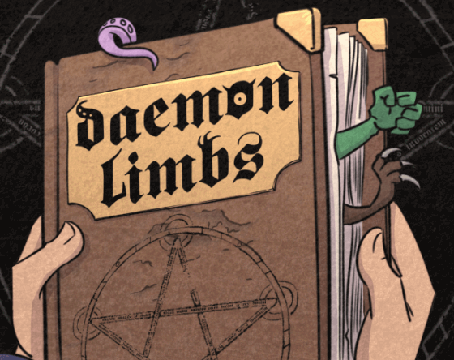

# Daemon Limbs

Created in **72H** for the **Ludum Dare 55** by [Bigaston](https://bigaston.itch.io), [Darwyn](https://noemathieu.wixsite.com/nm-pro-son), [Mifflue](https://www.twitch.tv/mifflue) and [Nyeut](https://nyeut.itch.io)

Your summoning went terribly wrong! Run from the creature you've summoned and try to send it back to where it came from!

Find the incantation that matches the monster's body to make it harmless. Unfortunately, only the torso matches! You will need to use other spells to transform the other parts of the body until you can use the ultimate spell!

Available on [itch.io](https://sleepyilve.itch.io/daemonlimbs)

## Licences

- All of the code is under the [MIT Licence](./.support/MIT_Licence.txt)
- All of the visual assets are owned by [Mifflue](https://www.twitch.tv/mifflue)
- All of the audio assets are owned by [Darwyn](https://noemathieu.wixsite.com/nm-pro-son)